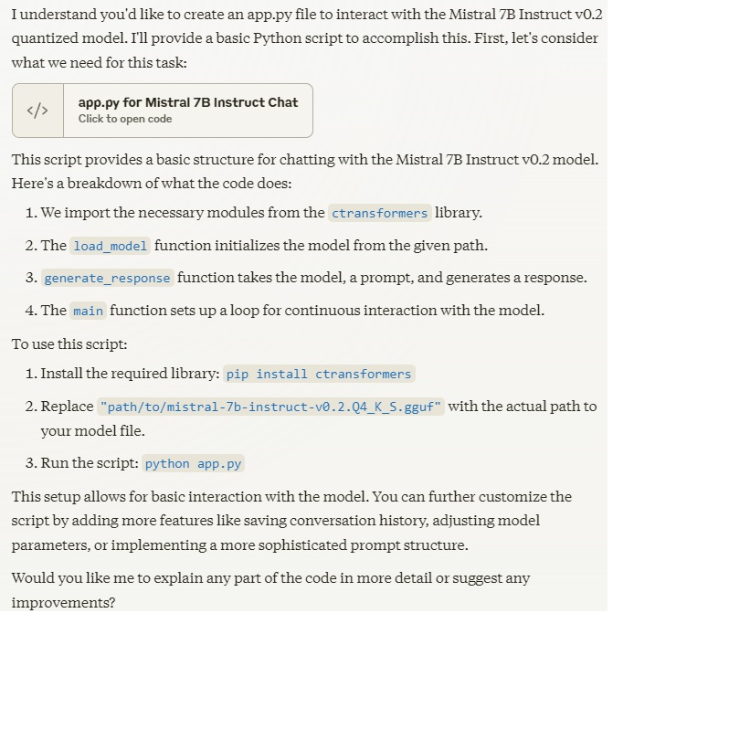

# Basic interaction with a local language model

This script was developed by Claude 3.5. It helps me understand the basic structure for interacting with a local language model.

## To use this script:

* Install the required library: `pip install ctransformers`

* Replace `"path/to/mistral-7b-instruct-v0.2.Q4_K_S.gguf"` with the actual path to your model file.

* Run the script: `python app.py`

## Use LM Studio to get oper source LLM model. It will be saved under User Folders in Windows. 

## Chat with Claude

---

## License

This project is licensed under the MIT License - see the [LICENSE](LICENSE) file for details.

---

Made with ❤️ by [Allen Sun](https://github.com/allenintaipei)
